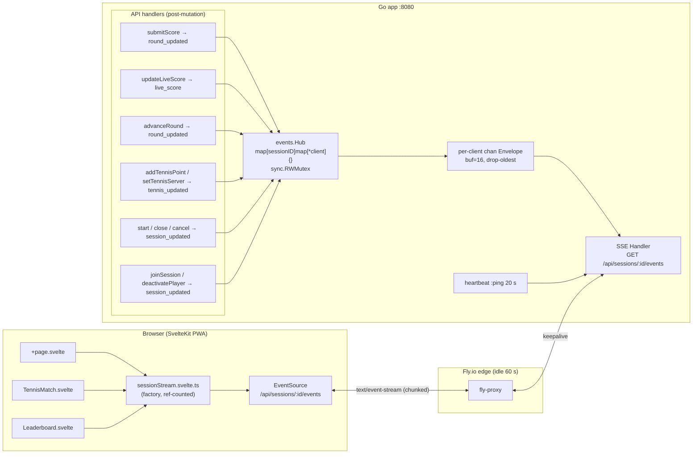

# Architecture — OpenPadel

## Overview

Single Go binary serves both the REST API and the compiled SvelteKit static build.
No separate web server needed. SQLite on disk. Deployed as a single Fly.io machine.

```
┌─────────────────────────────────────┐
│              Fly.io VM              │
│                                     │
│  Go binary                          │
│  ├── /api/*        → REST handlers  │
│  ├── /api/sessions/:id/events → SSE │
│  └── /*            → SvelteKit PWA  │
│                                     │
│  /data/openpadel.db   SQLite file   │
└─────────────────────────────────────┘
```

---

## Project Structure

```
openpadel/
├── cmd/
│   ├── server/main.go           entrypoint — wires store, email, router; reads env
│   └── migrate/main.go          CLI for running migrations (up, down, status, reset)
├── internal/
│   ├── api/
│   │   ├── router.go           chi router, CORS, middleware, all route registrations
│   │   ├── middleware.go       requireAuth / optionalAuth, context helpers
│   │   ├── respond.go          respond() and respondError() helpers
│   │   ├── auth.go             register, login, logout, me, profile, history, deleteAccount, forgot/reset
│   │   ├── sessions.go         create, get, start, cancel, close session
│   │   ├── players.go          join, deactivate player
│   │   ├── rounds.go           get rounds, current round, advance, submit score, live score, leaderboard
│   │   ├── tennis.go           set teams, get match, add point, set server
│   │   ├── mexicano.go         Mexicano-specific handlers
│   │   ├── contacts.go         get, add, remove contacts; search users
│   │   ├── invites.go          get, send, accept, decline invites
│   │   └── push.go             VAPID key, subscribe, unsubscribe
│   ├── domain/session.go       all shared types (User, Session, Player, Round, Match, etc.)
│   ├── store/                  SQLite data access — one file per domain area
│   │   ├── store.go            DB init via goose migrations, WAL mode, single connection
│   │   ├── migrations/         versioned SQL migration files (goose format: -- +goose Up/Down)
│   │   ├── id.go               newID() (4-char base32), newAdminToken() (tok_ + base58)
│   │   ├── sessions.go
│   │   ├── players.go
│   │   ├── rounds.go
│   │   ├── users.go
│   │   ├── tennis.go
│   │   ├── contacts.go
│   │   ├── invites.go
│   │   └── push.go
│   ├── events/
│   │   ├── envelope.go         Envelope type + event-type constants
│   │   ├── hub.go              thread-safe SSE client registry (sync.RWMutex, per-session subs)
│   │   └── handler.go          ServeSSE — streams events, 20s keepalive, X-Accel-Buffering: no
│   ├── scheduler/
│   │   ├── americano.go        greedy round-generation, full bench rotation pre-computed
│   │   └── mexicano.go         Mexicano variant — pairings adapt based on standings
│   ├── tennis/scoring.go       pure tennis scoring engine (sets, games, tiebreak, golden point)
│   ├── livescores/store.go     in-memory concurrent map for live/in-progress scores
│   ├── email/resend.go         Resend API client — password reset only
│   └── ui/ui.go                embed.FS wrapper — serves SPA, injects OG meta tags
├── web/                        SvelteKit frontend source
├── Dockerfile                  two-stage build: bun → go binary with embedded frontend
└── fly.toml                    Fly.io config, SQLite volume at /data
```

---

## Auth

Email/password authentication. Opaque bearer tokens stored in DB.

```
POST /api/auth/register   → creates user + issues token
POST /api/auth/login      → verifies bcrypt hash, issues token
Header: Authorization: Bearer <token>
```

Session admin tokens are separate (`tok_` + 32 base58 chars), issued at session creation
and stored in the browser's `localStorage`.

---

## Game Modes

| Mode            | Status | Description                                                  |
|-----------------|--------|--------------------------------------------------------------|
| Americano       | Live   | Rotating partners, individual scoring, pre-computed rounds   |
| Mexicano        | Live   | Like Americano, but pairings adapt each round by standings   |
| Tennis          | Live   | Regular 2v2 with sets, games, serve tracking                 |
| Timed Americano | Live   | Americano with fixed duration, free scoring, drift correction|
| Round Robin     | Planned| Every pair plays every other pair                            |

---

## API

Base path: `/api`. Content-Type: `application/json` throughout.
Errors: `{ "error": "human readable message" }`

### Auth
```
POST   /api/auth/register
POST   /api/auth/login
POST   /api/auth/logout
GET    /api/auth/me
PUT    /api/auth/profile
GET    /api/auth/history
DELETE /api/auth/account
POST   /api/auth/forgot-password
POST   /api/auth/reset-password
```

### Sessions
```
POST   /api/sessions
GET    /api/sessions/:id
POST   /api/sessions/:id/start
POST   /api/sessions/:id/cancel
POST   /api/sessions/:id/close
```

### Players
```
POST   /api/sessions/:id/players
DELETE /api/sessions/:id/players/:player_id
```

### Rounds & Scores
```
GET    /api/sessions/:id/rounds
GET    /api/sessions/:id/rounds/current
POST   /api/sessions/:id/rounds/advance
PUT    /api/sessions/:id/matches/:match_id/score
PATCH  /api/sessions/:id/matches/:match_id/score   (live score tap, in-memory only)
GET    /api/sessions/:id/leaderboard
```

### Server-Sent Events
```
GET    /api/sessions/:id/events   (text/event-stream, no auth required)
```

### Tennis
```
POST   /api/sessions/:id/tennis/teams
GET    /api/sessions/:id/tennis
POST   /api/sessions/:id/tennis/point
PUT    /api/sessions/:id/tennis/server
```

### Contacts & Invites
```
GET    /api/contacts
POST   /api/contacts
DELETE /api/contacts/:contact_id
GET    /api/users/search

GET    /api/invites
POST   /api/sessions/:id/invites
PUT    /api/invites/:invite_id/accept
PUT    /api/invites/:invite_id/decline
GET    /api/sessions/:id/invites
```

### Push Notifications
```
GET    /api/push/vapid-public-key
POST   /api/push/subscribe
DELETE /api/push/unsubscribe
```

---

## Real-Time: Server-Sent Events

Live updates are pushed via SSE rather than polling. A single in-memory `Hub`
(one per Go process) manages per-session client subscriptions.



### Event types

| Event | Payload | Emitted when |
|---|---|---|
| `session_updated` | _(signal)_ | session starts, closes, cancels; player joins/leaves |
| `round_updated` | _(signal)_ | score submitted, round advanced |
| `timer_sync` | `{round_duration_seconds, round_started_at, remaining_rounds, buffer_seconds}` | timed_americano round advanced (drift correction) |
| `live_score` | `{match_id, a, b, server}` | live score tap (PATCH, in-memory only) |
| `tennis_updated` | full `TennisMatch` | point scored, server changed |

### Frontend store (`sessionStream.svelte.ts`)

- Created once in `+page.svelte`, passed as a prop to child components
- `start()` opens the `EventSource` and binds `visibilitychange` / `online` / `offline`
- `onEvent(type, fn)` returns a cleanup function — components call it from `onMount` return
- `close()` called from `onDestroy` on the page
- Exponential back-off reconnect: 500 ms → 30 s
- Closes on tab hidden (iOS kills it anyway); reconnects on tab visible

### Edge cases

1. **Fly.io 60 s idle timeout** — the 20 s `: ping\n\n` heartbeat keeps the connection alive with 3× margin.
2. **iOS backgrounding + connection limit** — the store closes the `EventSource` when the tab is hidden, freeing the Fly soft limit of 80 concurrent connections per machine from zombie sockets.
3. **SQLite single-writer contention** — `Emit` is called after the transaction commits and is non-blocking (drop-oldest). SSE fan-out cannot back-pressure the DB writer.

### Fallback

A 30 s poll remains in `+page.svelte` as silent-failure insurance for corporate proxies that buffer SSE despite `Cache-Control: no-transform` and `X-Accel-Buffering: no`.

---

## Database

Migrations managed by **goose** (v3), a pure-Go migration tool. Migration files
live in `internal/store/migrations/*.sql` and are embedded into the binary via
`//go:embed`. Each migration is versioned (e.g., `000001_initial_schema.sql`)
with `-- +goose Up` and `-- +goose Down` directives.

Bootstrap logic handles existing production databases: if the schema is already
applied but no goose version table exists, the DB is marked at version 1 without
re-running migrations. Fresh databases get all migrations applied on first startup.

### Core tables

```sql
sessions  (id, admin_token, status, game_mode, name, courts, points,
           rounds_total, created_at, ended_at, ended_early)

players   (id, session_id, user_id, name, active, joined_at)

users     (id, email, display_name, password_hash, created_at)

auth_tokens          (token, user_id, created_at)
password_reset_tokens(token, user_id, expires_at, used)

rounds  (id, session_id, number)
bench   (round_id, player_id)
matches (id, round_id, court, p1, p2, p3, p4, score_a, score_b)

tennis_matches (id, session_id, ...)

contacts (user_id, contact_id, created_at)
invites  (id, session_id, inviter_id, invitee_id, status, created_at)

push_subscriptions (user_id, endpoint, p256dh, auth, created_at)
```

All times stored as `TEXT` in RFC3339. IDs are 4-char base32 (sessions) or
UUID-style (users/players). `crypto/rand` throughout.

---

## Scheduler

### Americano (`internal/scheduler/americano.go`)
Greedy round-by-round with a scoring function. All rounds pre-computed at session start.

Constraints (priority order):
1. **No consecutive bench** — benched in round N → must play round N+1
2. **Balanced bench** — bench slots distributed evenly
3. **Partner variety** — penalise recent partner repeats
4. **Opponent variety** — penalise recent opponent repeats

### Mexicano (`internal/scheduler/mexicano.go`)
Same constraints, but pairings are recalculated each round based on current standings.
No bench — requires exactly `courts × 4` players.

### Timed Americano (`internal/scheduler/timed_americano.go`)
Timer-based variant of Americano with fixed tournament duration and dynamic round timing.

**Key differences from Americano:**
- **No points constraint** — scores are free-form (not constrained to sum to a fixed total like 16/24/32)
- **Fixed tournament duration** — total minutes is configured at creation, rounds auto-play until timer expires
- **Drift correction** — after each round, remaining time is redistributed across remaining rounds (via `RecalculateRoundDuration`)
- **Automatic completion** — session ends when the timer expires and current round is fully scored
- **Pairing** — uses same greedy scheduler as Americano to generate all rounds upfront based on player count

Timer sync events (`timer_sync`) are emitted when advancing rounds, containing:
- `round_duration_seconds` — recalculated duration for the next round
- `round_started_at` — timestamp when the round started (for client-side countdown sync)
- `remaining_rounds` — number of rounds still to play
- `buffer_seconds` — time between rounds for setup/transitions

---

## Frontend

SvelteKit 5 SPA, compiled to `web/build/` and embedded into the Go binary via
`//go:embed all:build` in `internal/ui/`. Served at `/*` — the Go binary is the
only process needed.

Key patterns:
- **Svelte 5 runes** enforced globally (`$state`, `$props`, `$derived`, `$effect`)
- **API client** — single typed `api` object in `$lib/api/client.ts`
- **Auth store** — runes-based, token in `localStorage` under `auth_token`
- **Types** — all shared interfaces in `src/app.d.ts` under the `App` namespace
- **i18n** — English + Norwegian via `svelte-i18n`
- **Real-time** — SSE via `sessionStream` factory store; 30 s fallback poll as belt-and-braces

---

## Deployment

Two-stage Docker build: Bun builds the frontend, Go embeds it and compiles the binary.
Final image is a single static binary on Alpine (~20 MB).

```
fly deploy         # builds and deploys to Fly.io (Stockholm / arn region)
```

SQLite lives on a persistent Fly volume mounted at `/data/openpadel.db`.
WAL mode enabled, single connection (`SetMaxOpenConns(1)`).
Litestream replicates the database continuously to Tigris (S3-compatible) via the
`litestream replicate` sidecar. On container start, the DB is restored from the
replica if no local file exists.
